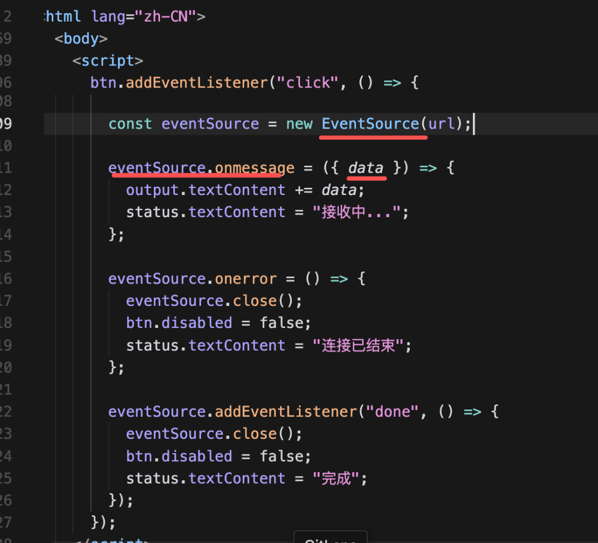

# Nest + LangChain 实现基于 SSE 的流式 ai 接口

## 创建项目

```sh
pnpm i -g @nestjs/cli
```

## 创建 crud 模块

```sh
# g 表示 generate，res 表示，--no-spec 表示无需单元测试
nest g res ai --no-spec
```

## nest 知识

- @Injectable 运行时会自动注入依赖的实例对象
- providers 提供某种能力的对象，@Injectable 的类需要 providers 提供出去
  - 第二种 provide: { provide: key, useFactory() {} }，通过 @Inject(key) 使用
- ConfigModule 提供全局配置

```js
@Module({
    // ...
    ConfigModule.forRoot({
        isGlobal: true,
        envFilePath: '.env'
    })
})
```

## 创建 chain

```js
// ai.service.ts
// constructor
this.chain = prompt.pipe(model).pipe(new StringOutputParser());

// runChain
this.chain.invoke();

// stremChain
async *streamChain(query: string): AsyncGenerator<string> {
    const stream = await this.chain.stream({ query })
    for await (const chunk of stream) {
        yield chunk
    }
}
```

```js
// ai.controller.ts
@Sse('chat/stream')
chatStream(@query('query') query: string): Observable<{ data: string }> {
    return from(this.aiService.streamChain(query).pipe(map((chunk) => ({ data: chunk }))))
}
```



静态资源

```ts
// @nestjs/serve-static
@Module({
    // ...
    imports: [
        // ...
        ServeStaticModule.forRoot({
            rootPath: path.join(__dirname, '..', 'public')
        })
    ]
})
```

提取model逻辑

```js
@Module({
    // ...
    providers: [
        AiService,
        {
            provide: 'CHAT_MODEL',
            useFactory: (configService: ConfigService) => {
                return new ChatOpenAI({
                    // ...
                })
            }
            inject: [ConfigService]
        }
    ]
})
```
